## Security fence with door
[//]: # (During my time at AMTEK the main task of my position was designing of security fences from aluminum profiles. Each fence layout is based on the customer's specifications and it is fitted with reinforcements, doors or active-electronic devices &#40;sensors, electronic locks, cameras, security lights, etc.&#41; as needed. Thanks to the variability of the MayCad profile system it is possible to quickly and cheaply create machine frames and thus replace the need for the production of specific parts and welding these parts into larger asemblies.)
A simple security fence with an opening door. The frame consists of aluminum profiles in size 40x40 and 40x80. The fillers are made from a welded mesh of  3 mm steel wire. The assy is further equipped with reinforcing sheet metal parts.

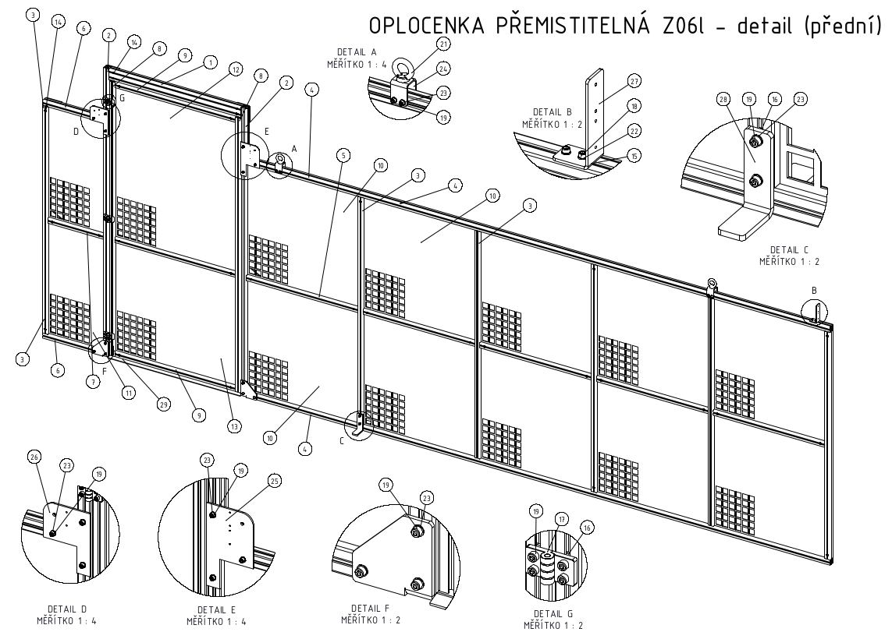
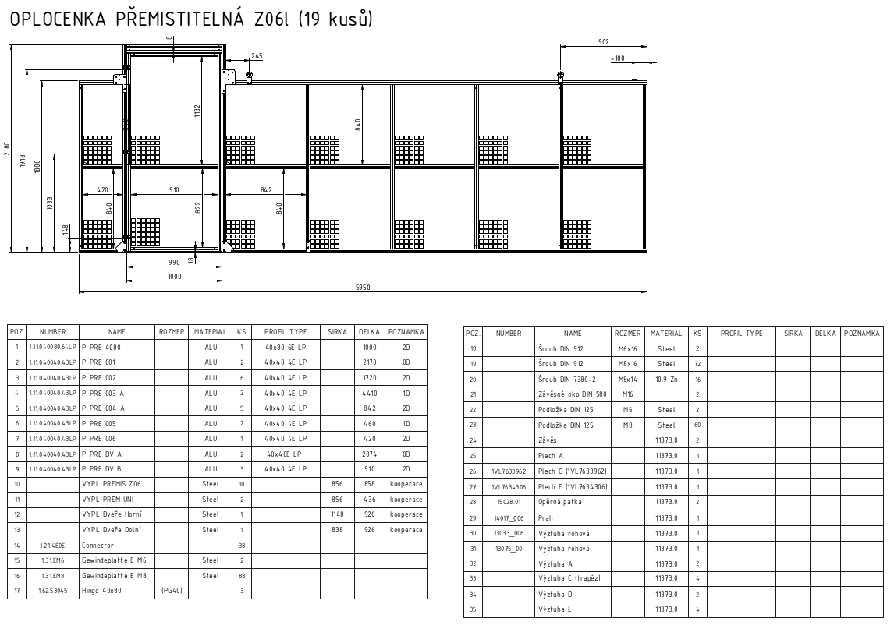

## 3D View of 

Example of creating an exploded view with labels for specific components. These views are very useful as support of production and that helps to eliminate possible errors.

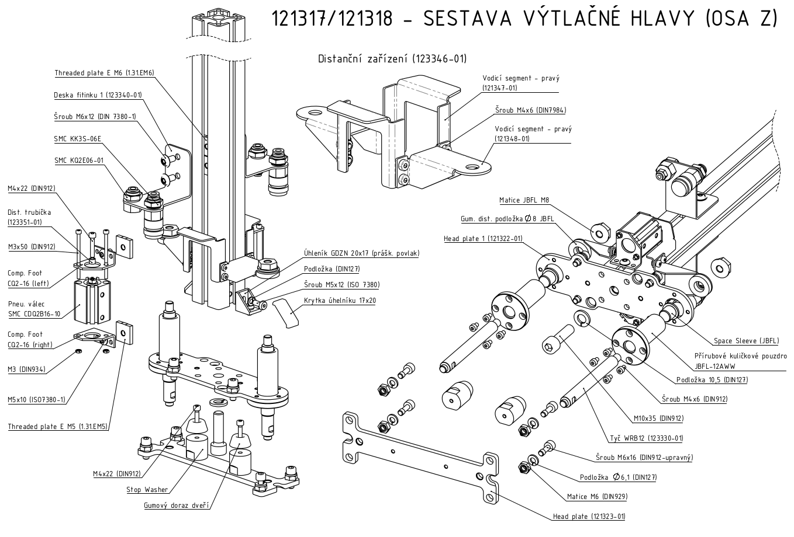

[//]: # (## Box)

[//]: # ()
[//]: # (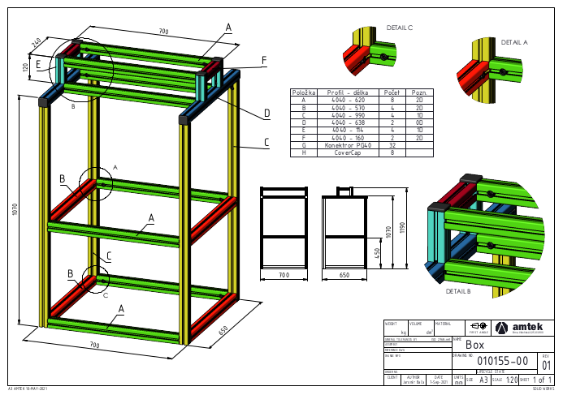)

## Hand Truck

Koncept jednoduchého hand truck, který vznikl dle požadavku zákazníka.

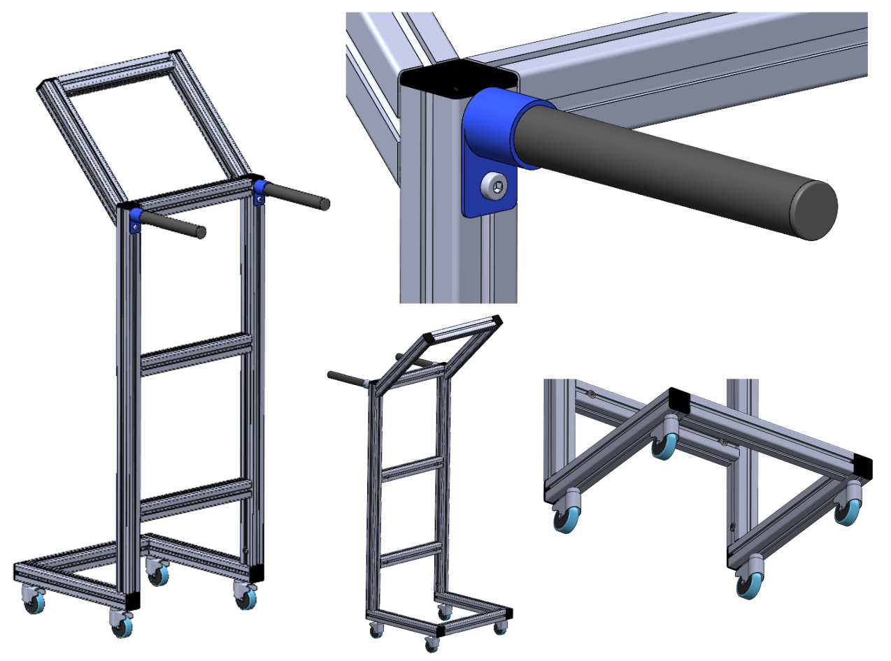

## Oploceni skladu

An internal project, which aimed to design the fence for secure a storage area and its separation from the rest of the warehouse. One of the requirements was to make a fence from scrap in order to reduce production costs. It means to use of reminder profiles and polycarbonate fillers from previous projects. For better orientation and easier assembly, fillers of the same size are marked with the same color.

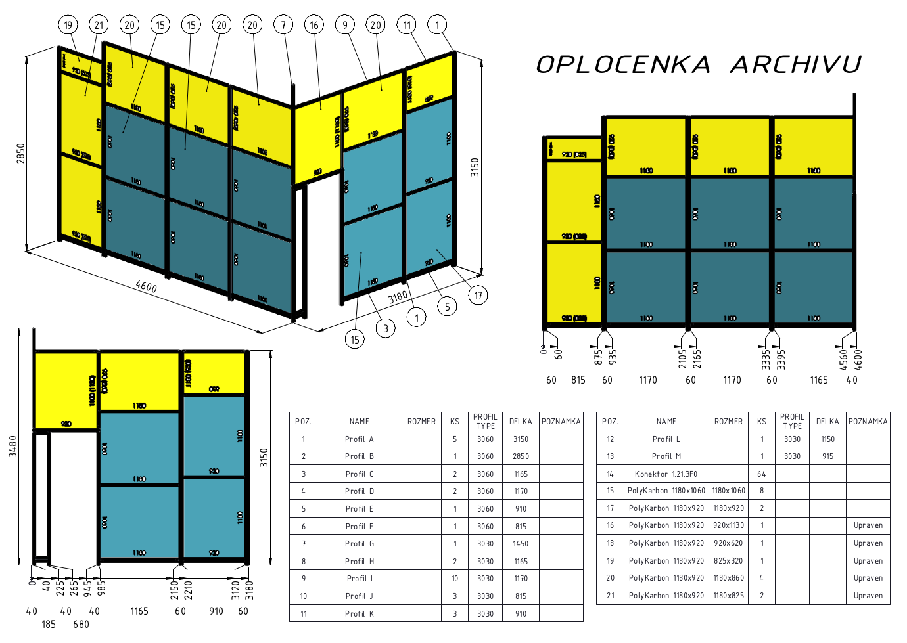
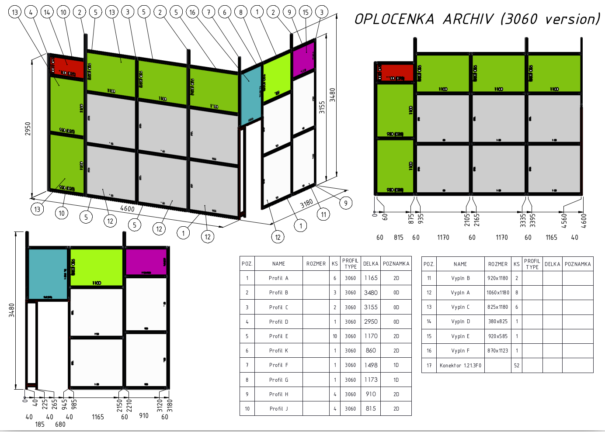

## Panorama

The concept of a roof of garden pool. Profiles with closed grooves were chosen for the clean design of the structure. Furthermore, for the panoramic part of the assembly, it is necessary to bend the aluminum profiles to the specified radius.

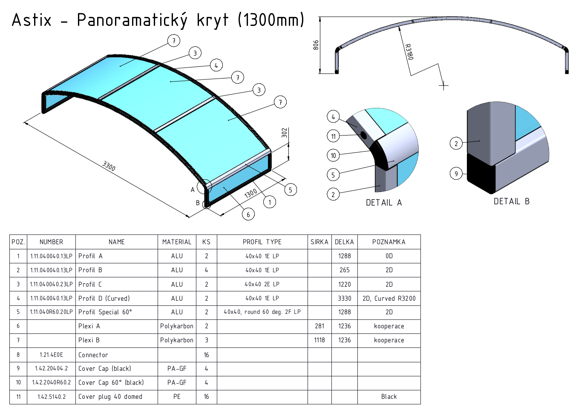

## Belt Conveyor

A solution for transporting sawdust from the woochipper. The requirement was to deliver sawdust to a certain point, which was around the corner and at a different height than the machine output. This problem was solved by the combination two belt conveyors.

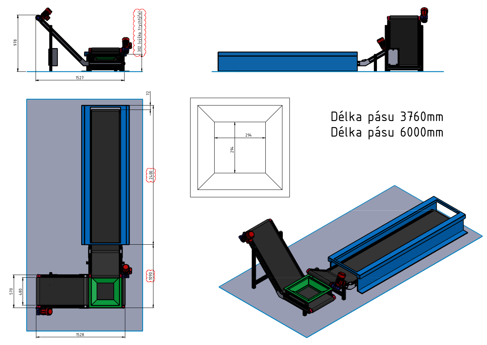
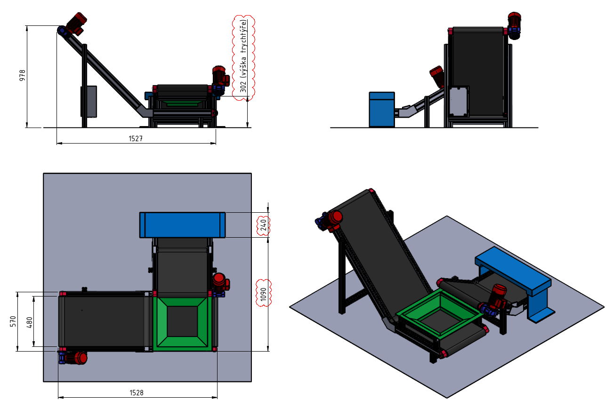

## Telescope

Design of telescopic arm with arresting locks (item 13).

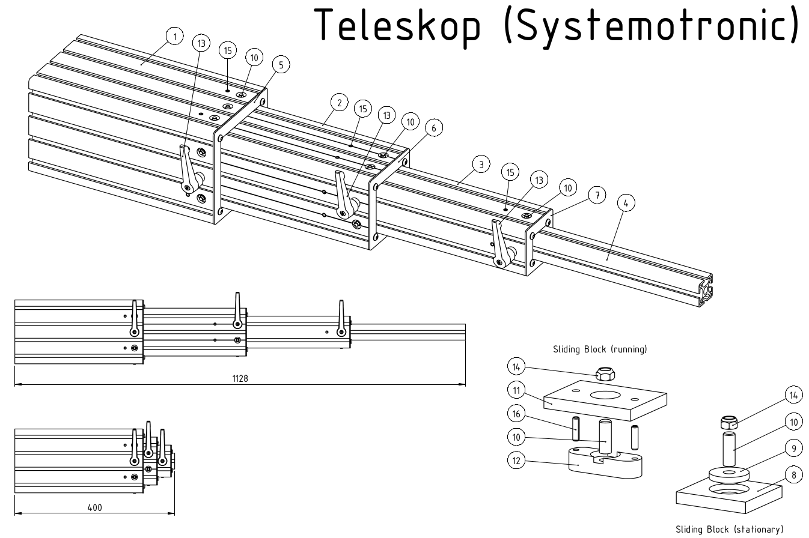
